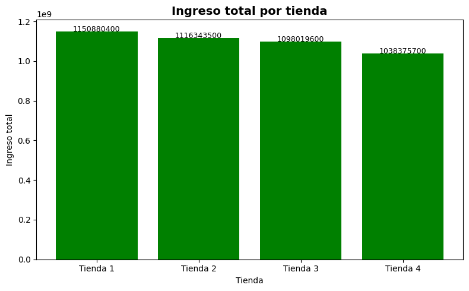
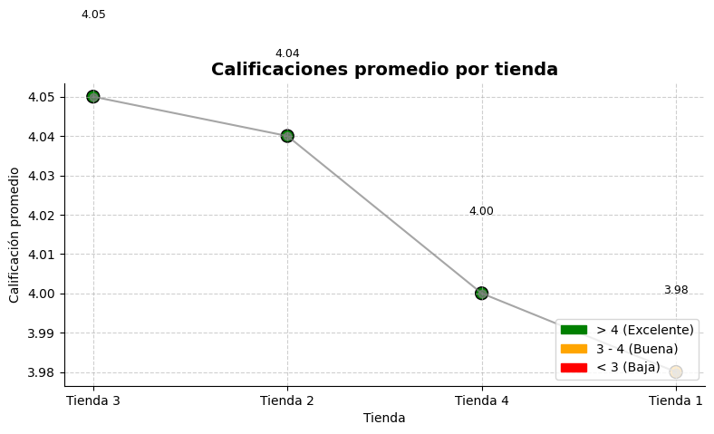
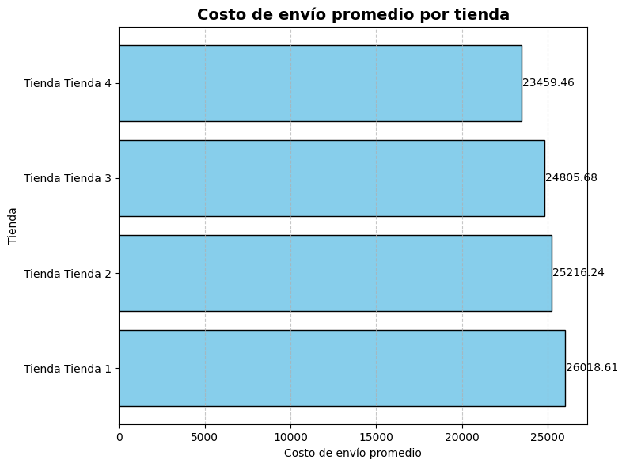

# 📊 Análisis de Optimización Comercial: Alura Store

## 📝 Resumen del Proyecto
Este proyecto aplica técnicas de **Ciencia de Datos** para evaluar el desempeño operativo y financiero de cuatro sedes de "Alura Store". El análisis busca identificar la unidad de negocio con menor rendimiento para optimizar la cartera de inversiones de la empresa.

## 🎯 Objetivo de Negocio
Determinar mediante indicadores clave (KPIs) qué tienda es la candidata ideal para la venta, permitiendo al inversor liberar capital para nuevos emprendimientos sin comprometer la rentabilidad global.

---

## 📈 Visualizaciones Clave

### 1. Desempeño Financiero (Revenue)
Se analizó la facturación total para identificar el motor económico de la cadena.

* **Insight:** La **Tienda 1** es la líder en ventas ($1.15M), mientras que la **Tienda 4** presenta el volumen de ventas más bajo ($1.03M).

### 2. Satisfacción del Cliente (Rating)
Evaluamos la calidad del servicio percibida por los usuarios.

* **Insight:** La **Tienda 3** mantiene el liderazgo en satisfacción (4.05). Existe un área de riesgo en la **Tienda 1**, que a pesar de vender más, tiene la calificación más baja (3.98).

### 3. Eficiencia Logística
Análisis del impacto de los costos de envío por unidad.

* **Insight:** La **Tienda 4** es la más eficiente logísticamente (menor costo de envío), pero esto no compensa su baja rotación de ventas.

---

## 🛠️ Metodología
1.  **Data Cleaning:** Procesamiento de datasets con 12 variables críticas.
2.  **Agregación de Datos:** Cálculo de métricas de tendencia central para precios, costos y valoraciones.
3.  **Análisis Comparativo:** Benchmarking entre las 4 unidades de negocio.
4.  **Data Visualization:** Creación de dashboards informativos con `Matplotlib`.

## 💡 Conclusión y Recomendación Estratégica
Basado en el análisis de datos, la recomendación técnica es **vender la Tienda 4**. 

**Justificación:**
* Es la menos eficiente en generación de ingresos totales.
* Su venta no impacta los productos estrella de la cadena (concentrados en Tienda 1 y 2).
* Su alta calificación y bajos costos de envío la hacen un activo **atractivo para compradores**, facilitando una salida rápida y rentable para el Sr. Juan.

---
**Desarrollado por:** [ANGEL-ALMANZA]  
*Data Science Challenge - Alura Latam*
